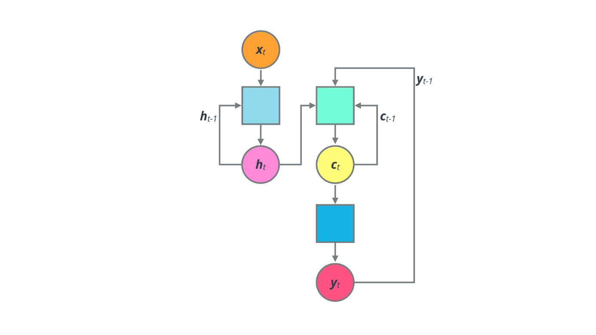

# Machine-translation-English-French-with-Deep-neural-Network
 Build a deep neural network that functions as part of an end-to-end machine translation pipeline

This project is part of [Udacity Natural Language Processing (NLP) nanodegree](https://www.udacity.com/course/natural-language-processing-nanodegree--nd892).

The objective is to build a machine translation model. The pipeline will accept English text as input and return the French translation.

# Introduction

Machine Translation can be thought of as a sequence-to-sequence learning problem.
You have one sequence going in, i.e. a sentence in the source language, and one sequence coming out, its translation in the target language.
This seems like a very hard problem. But recent advances in Recurrent Neural Networks have shown a lot of improvement. A typical approach is to use a recurrent layer to encode the meaning of the sentence by processing the words in a sequence, and then either use a dense or fully-connected layer to produce the output, or use another decoding layer.
Experimenting with different network architectures and recurrent layer units (such as LSTMs, GRUs, etc.), you can come up with a fairly simple model that performs decently well on small-to-medium size datasets. Commercial-grade translation systems need to deal with a much larger vocabulary, and hence have to use a much more complex model, apply different optimizations, etc. Training such models requires a lot of data and compute time.

For a neural network to predict on text data, it first has to be turned into data it can understand. Since a neural network is a series of multiplication and addition operations, the input data needs to be numbers. We can turn each character into a number or each word into a number. These are called character and word ids, respectively. Character ids are used for character level models that generate text predictions for each character. For a simple character level model, you can visit my other project about [decyphering a code with a simple RNN](). A word level model uses word ids that generate text predictions for each word.

# Basic RNN architecture

We convert each word or token into a one-hot encoded vector, and stack those vectors into a matrix. Once we have the sequence of word vectors, we can feed them in one at a time to the neural network. 

A RNN network comprizes the following key components:
- Embedding Layer: The first layer of the network is typically an embedding layer that helps enhance the representation of the word. This produces a more compact word vector that is then fed into one or more recurrent layers. Note: You could skip the embedding step, and feed in the one-hot encoded vectors directly to the recurrent layer(s). This may reduce the complexity of the model and make it easier to train, but the quality of translation may suffer as one-hot encoded vectors cannot exploit similarities and differences between words.
- Recurrent Layer(s): This is where the magic happens! The recurrent layer(s) help incorporate information from across the sequence, allowing each output word to be affected by potentially any previous input word. 
- Dense Layer(s): The output of the recurrent layer(s) is fed into one or more fully-connected dense layers that produce softmax output, which can be interpreted as one-hot encoded words in the target language. As each word is passed in as input, its corresponding translation is obtained from the final output. The output words are then collected in a sequence to produce the complete translation of the input sentence.

It’s easier to understand how this works over time if we unroll the network. Each copy of the network represents its state at the respective time step t. At any time t, the recurrent layer receives input x_t as well as the state vector from the previous step, h_t−1. This process is continued till the entire input is exhausted. Each cell is the same network, repeated over time as it processes the input sequence.

**The main drawback of such a simple model is that we are trying to read the corresponding output for each input word immediately. This would only work in situations where the source and target language have an almost one-to-one mapping between words.**
What we should ideally do is to let the network learn an internal representation of the entire input sentence, and then start generating the output translation. 

This can be achieved using two different networks which we will cover in next section. 

# Encoder-Decoder RNN architecture

The first network is called an Encoder, which accepts the source sentence, one word at a time, and captures its overall meaning in a single vector or context vector. This is simply the state vector at the last time step. Note that the encoder network is not used to produce any outputs.

The second network is called a Decoder, which then interprets the context vector and expands it into the corresponding sentence in the target language, again one word at a time. In this manner, Neural Machine Translation model  addresses the local translation problem in the traditional phrase-based approach: it can capture long-range dependencies in languages, e.g., gender agreements; syntax structures; etc., and produce much more fluent translations as demonstrated by [Google Neural Machine Translation systems](https://ai.googleblog.com/2016/09/a-neural-network-for-machine.html).

If we roll back the time steps, we can see what the overall architecture looks like (encoder in light blue, decoder in green). The encoder vector tries to contain as much of the useful input information as possible to help the decoder get the best results. It’s the only information from the input that the decoder will get. The deep blue corresponds to the Dense layer section predicting the next work over the target vocabulary. This is basically an Embedding layer coverting back to the target language.

This encoder-decoder design is very popular for several sequence-to-sequence tasks, not just Machine Translation. It is effective for image captioning for instance. You can check out an implementation [here](https://github.com/LaurentVeyssier/Image-Captioning-Project-with-full-Encoder-Decoder-model).

Neural Machine Translation models vary in terms of their exact architectures. A natural choice for sequential data is the recurrent neural network (RNN), used by most NMT models. Usually an RNN is used for both the encoder and decoder. The RNN models, however, differ in terms of: (a) directionality – unidirectional or bidirectional; (b) depth – single- or multi-layer; and (c) type – often either a vanilla RNN, a Long Short-term Memory (LSTM), or a gated recurrent unit (GRU). Bidirectionality on the encoder side generally gives better performance (with some degradation in speed as more layers are used). 

Steps:
- Preprocess - Convert text to sequence of integers.
- Models - Create models which accepts a sequence of integers as input and returns a probability distribution over possible translations
- Prediction - Run the model on English text to return French translation.
